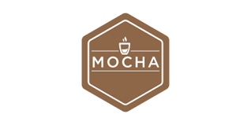

# Node JS REST API Development Boilerplate

## Author - Sangheon Kim(ksj8367@gmail.com)

## Version - 1.0.0

## Technique

  &nbsp;
  &nbsp;
  &nbsp;

## USAGE

<pre>git clone https://github.com/sangheon-kim/Server-config-boilerplate.git</pre>

## Language - Typescript

## Tools

- Node JS with Typescript

## Testing Tools

- Mocha

## description

- Rest API can be used as GraphQL. (REST API를 GraphQL 처럼 사용도 가능합니다)
- As a result, the number of APIs will be reduced.(따라서 API 개수는 줄어들 것입니다.)

## Happy Hacking!
